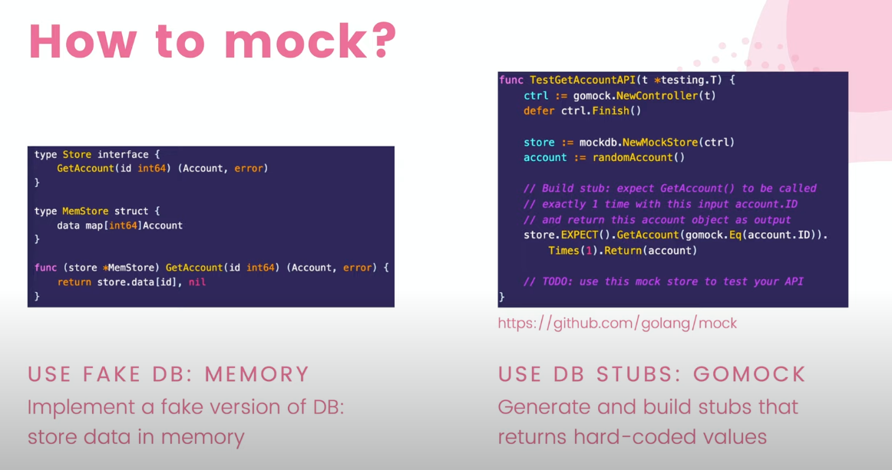

# Log


## 15.12.2023: Lezione 1
https://www.youtube.com/watch?v=TtCfDXfSw_0&list=PLy_6D98if3ULEtXtNSY_2qN21VCKgoQAE&ab_channel=TECHSCHOOL

Ho fatto il design del DB con `dbdiagram.io`

    ha creato tutte le tabelle in dbdiagram con le varie references
    poi ha esportato a sql `Export to postgreSQL` e  

Ho installato sqlc con `go install github.com/sqlc-dev/sqlc/cmd/sqlc@latest`

## 15.12.2023: Lezione 2 - Setup development environment on windows

wsl, vscode, etc... docker


## 15.12.2023: Lezione 3 - Setup development environment on macos
go, vscode 

## 17.12.2023: Lezione 4 - Use docker + tableplus to create db schema
https://www.youtube.com/watch?v=0CYkrGIJkpw&list=PLy_6D98if3ULEtXtNSY_2qN21VCKgoQAE&index=4


Fa partire postgres in docker container. ... tutto dal terminal.

Poi, per testare, usa docker exec per loggarsi al container... con `psql -U root` come comando.

Poi testa:
`select now()`


Poi installa tableplus ... e esegue tutte le query esportate precedentemente. 
Vede che le tables sono state create nel db. 
Controlla lo schema e fa vari fix su quello che si aspetta...va dietro a dbdiagram e riesporta. 


## 17.12.2023: Lezione 5 - How to write & run database migration in golang


Schema migration 
usiamo golang migrate library per schema migration 

installato go migrate cli via brew

poi ho creato un target in makefile per fare la migrazione. 

`make migrate` fa il trick. 

Istruzioni qui: https://github.com/golang-migrate/migrate/blob/master/GETTING_STARTED.md#create-migrations

Importante da notare:
> IMPORTANT: In a project developed by more than one person there is a chance of migrations inconsistency - e.g. two developers can create conflicting migrations, and the developer that created their migration later gets it merged to the repository first. Developers and Teams should keep an eye on such cases (especially during code review). Here is the issue summary if you would like to read more.

> Consider making your migrations idempotent - we can run the same sql code twice in a row with the same result. This makes our migrations more robust. On the other hand, it causes slightly less control over database schema - e.g. let's say you forgot to drop the table in down migration. You run down migration - the table is still there. When you run up migration again - CREATE TABLE would return an error, helping you find an issue in down migration, while CREATE TABLE IF NOT EXISTS would not. Use those conditions wisely.


L'idea e':
- prima faccio il design del db in [dbdiagram] (https://dbdiagram.io/d/Simple-bank-63b48c837d39e42284e8b75c) 
- poi esporto il codice postgressql per creare quel db
- creo una migrazione 
- copio tutto questo codice generato direttamente nei migration files

## 18.12.2023: Lezione 6 - CRUD operations sul db
https://www.youtube.com/watch?v=prh0hTyI1sU&list=PLy_6D98if3ULEtXtNSY_2qN21VCKgoQAE&index=5

In pratica ho installato sqlc... 

Con `sqlc init` mi crea un file sqlc.yaml in root.

A questo punto sono andato sul sito di sqlc ed ho copiato un config di esempio... a cui ho sostituito i valori come nel tutorial.
Attenzione, io sto usando la versione 2, nel tutorial usa la versione 1. Bisogna adattarla campo per campo. 
Nel mio caso ho levao il field cloud e il riferimento a managed db.

Ricapitolando:
- in `db` folder abbiamo:
    - migration: contiene tutte le migrazioni. Vi punto anche dal sqlc.yaml
    - query: e' la folder dove inserisco tutte le query che do in input a sqlc... contenenti le varie annotazioni di sqlc
    - sqlc: e' la mia folder ti output contenenti tutto il codice generato

In pratica ho scritto tutte le query per crud in account.sql e generato il codice corrispondente. 

19.12.2023: Lezione 5: write unit test for database CRUD
https://www.youtube.com/watch?v=phHDfOHB2PU&list=PLy_6D98if3ULEtXtNSY_2qN21VCKgoQAE&index=6

Installato il driver pg: `go get github.com/lib/pq`

Poi abbiamo creato i test... main_test.go e account_test.go


NB. ho dovuto commentare la riga `sql_package: "pgx/v5"` in sqlc.yaml altrimenti la conn non funzionava... non veniva presa salla New()

Ho anche creato il random generator e un nuovo target per test nel Makefile. 

## 19.12.2023: Lezione 7 - A clean way to implement database transaction in Golang
https://www.youtube.com/watch?v=gBh__1eFwVI 

Qui si introducono le transactions.

Come prima cosa creo un nuovo file store.go in cui definisco una struct in cui definire il supporto per le transazioni. 

Questa struct fornisce tutte le funzioni per eseguire le query individualmente cosi come la loro combinazione con le transazioni.

Per le query individuali abbiamo gia la struct Queries generata da sqlc. 

Each query only does one query on a specific table. Queries struct does not support transactions. 
This is why we have to extend its functionality by embedding inside the struct by composition.

We need to embed also the db object in order to support for transactions 


`execTx` e' una funzione che serve per eseguire una transazione generica. L'idea e' semplice. Il concetto e' prendere un context e una callback function come input ... una sorta di wrapper. 

BeginTx e' l'inizio della transazione... 

Allochiamo un oggetto di tipo `Queries` che mi viene restituito dalla New generata dal `sqlc`.

NB. il parametro options passato a BeginTx serve per settare l'isolation method.

La struttura e' una sorta di wrapper con:
- begin
- rollback in caso di errore
- commit in caso di successo


## 19.12.2023: Lezione 8 - DB transaction lock & How to handle deadlock in Golang
https://www.youtube.com/watch?v=G2aggv_3Bbg

Qui vediamo i transaction locks.

Usa TDD per questo video.

In soldoni, fa notare come transfer tx contiene un deadlock... 
e questo deadlock e' dovuto al fatto che viene richiesto un lock su una select dovuta alle foreign keys.
C'é una dipendenza tra account e transfer table via foreign key... 
Se la si disabilita ... si risolve il deadlock... 
ma non e'la soluzione ideale... vogliamo mantenere la foreign key contraint...
quindi lo rimette ... e prova a risolvere in un altro modo.

.... 

Come risolve? Aggiungendo "FOR NO KEY UPDATE"in GetAccountForUpdate. In tal modo diciamo a postgres di non fare lock per quella select in quanto non andremo a toccare quella chiave... 

Alla fine fa vedere come migliorare il codice della transferTx... aggiungendo AddAccountBalance.

NB. per modificare e rinominare un argument in sqlc... 
invece di $2, usa sqlc.arg(NEWNAME)

NEWNAME e' il nome del nuovo parametro generato nella corrispondente request struct. 


## 22.12.2023 - Lezione 9 - how to avoid db deadlock

Uso questa query per controllare i lock:
```sql
SELECT a.application_name,
         l.relation::regclass,
         l.transactionid,
         l.mode,
		 l.locktype,
         l.GRANTED,
		 a.pid,
         a.usename,
         a.query,
         a.query_start,
         age(now(), a.query_start) AS "age",
         a.pid
FROM pg_stat_activity a
JOIN pg_locks l ON l.pid = a.pid
WHERE a.application_name = 'psql'
ORDER BY a.query_start;
```

Da questa query vedo quali query hanno un lock, lo stato del lock (granted, cioe' se e' stato concesso o no) e tante altre info.

Per esempio, la transaction id, il tipo di lock, se shared o exclusive. 

Piu' dettagli qui... nb. transaction id mi dice l'id della transazione che sta aspettando la transazione corrente.

(ID of the transaction targeted by the lock, or null if the target is not a transaction ID)

https://www.postgresql.org/docs/current/monitoring-stats.html

How to prevent deadlocks? 
To make sure all applications always aquire locks in a consistent order. 

Che significa? 
Se una transazione deve fare l'update di due account, account1 e account2.
Possiamo definire una regola secondo la quale facciamo l'update a partire dall'account id piu' piccolo. 

In questa lezione abbiamo anche creato un metodo helper AddMoney per refactoring.


## 26.12.2023 - Lezione 10 - Transaction isolation level
https://www.youtube.com/watch?v=4EajrPgJAk0

Spiega prima la teoria poi fa qualche esempio con pqsl per dimostrare i vari tipi di isolation.


## 26.12.2023 - Lezione 11 - Setup Github Actions for Golang + Postgres to run automated tests
https://www.youtube.com/watch?v=3mzQRJY1GVE

Ho creato un nuovo repository in github e pushato il codice. 
L'ho chiamato work_simplebank (a differenza di quello esistente work-simplebank).

We created just a test job which triggers `make test`. At the first execution we expect the job to fail as we dont have a database to which we can connect from the pipeline. 

We search then for a `gitlab action` to setup the postgres db. 
We connect to [postgres action](https://docs.github.com/en/actions/using-containerized-services/creating-postgresql-service-containers)

In order to make it working we had to add a small piece to the pipeline regarding the port exposing. 

```git
ports:
    # Maps tcp port 5432 on service container to the host
    - 5433:5432
```

in our case....


## 27.12.2023 - Lezione 13 - Implement RESTful HTTP API in Go using Gin
https://www.youtube.com/watch?v=n_Y_YisgqTw

Here we write the api with GIN.


We also start with the validator framework in GIN. 


We wrote an `errorResponse` function to support and make gin able to convert an error to a key-value object. 


ctx.JSON() is a function which serializes the given struct as JSON into the response body.
It also sets the Content-Type as "application/json".

NB. we have a `gin.H` shortcut to `map[string]any` we can use to implement the errorResponse function. 
This will be the object to return.

Created the Start method to start the server.

We created the main.go and instantiated the server, with the db etc... 

Next we tried to run (added also a make server target in makefile) the server and try the createAccount REST call from Postman.
Also tried the validation methods by checking e.g. empty fileds provided --> http error code and msg... 


Here we implemented getAccount method, by getting an input parameter (id) from uri.
Next he mentions to implement pagination on listAccounts... but instead of taking input parameters from request body or uri, we get it from query string... (e.g. ...accounts?page_id=0&page_size=5)

Once implemented, we tested the same with postman. Also noticed that if providing a non existing page id, it returns "null".
So, we modified sqlc conf file by adding `emit_empty_slices: true` so that we get `[]`.

## 06.01.2024 - Lezione 14 - Load config from file & environment variables in Golang with Viper

Atm we are encoding in constan variables several parameters like db related ones. 

We install viper... and then add viper to load from config file to Config struct.


## 05.02.2024 - Lezione 15 - Mock DB for testing HTTP API in go and achieve 100% coverage 

Why use mock database? 

- It helps to write independent tests easily ... it isolate tests data to avoid conflicts.
- Faster tests: it recudes a lot of time talking to the database. 
- 100% coverage: easily setup edge cases: unexpected errors


Is it good enough to test our API with a mock DB? Yes!. Our real db store is already tested in previous lectures. 

Mock db and real db should implement the same interface. 

### How to mock db? 
Two ways:
- use fake db: in memory
    implement a fake version of DB: store data in memory
    CONS: it requires to write much more code... 
- Use DB stubs: gomock
  - generage and build stubs that returns hard-coded values





First we have to install for gomock.

`go install github.com/golang/mock/mockgen@v1.6.0`

we need to replace the store object with an interface... 

E' importante notare che il nostro obiettivo e' quello di creare un interfaccia che includa il metodo TransferTx e tutti i metodi della sotto struct Queries. Ma non vogliamo ripetere tutto.... 
fortunatamente in sqlc abbiamo un emit_interface option che possiamo settare a true. 

Queries struct e' la struct generata da sqlc... in db.go.

Dopo aver settato a true questo parameter... e rigenerato con make sqlc, otteniamo un nuovo file `querier.go` contenente la nostra interfaccia Querier. 

Con la Store interface... passata al metodo NewServer ora possiamo implementare una versione mocked che implementi tale interface al posto del db reale. 

NB. nel main gli step sono:
- instanzia uno store --> nel nostro caso sara' mocked per i test
- poi istanzia un server passandogli lo store
- fai partire il server


### Creazione del mock...

Creo una mock folder nel db package. 

Useremo la reflection per generare i mock... c'e' anche un altro modo.


Ho creato un target nel makefile per generare il mio mock db. 

Nel db/mock/store.go ho il mio mock db... 
c'e' una struct MockStore con tutti i metodi implementati dell'interfaccia che ho specificato nel makefile target/mockgen command. 


Ora posso creare il mio test... parto dal GetAccount... 
In account_test.go creo un TestGetAccountAPI method... 

Il mockstore ha un factory method che riceve un controller. 
Il controller e' generato via gomock.NewController.. 


## 12.04.2024 - Lezione 16 - Custom validator

Qui si inizia implementando la parte dell'api relativa alla nuova rouse POST transfers. Per creare nuovi transfer. Il backend gia c'e' ... manca solo il metodo nell'api. 

A questo punto, il tizio dice che le regole di validazione presenti nei go tags sono HARD CODED e che dovremmo trovare qualcosa di meglio. 
e.g.`oneof=USD EUR CAD`. 

Usiamo un custom validator. 

Creiamo un file `validator.go`


Non ho capito molto come ha fatto il casting del validator... da quanto ho capito, il framework usato e' supportato da gin... ma non ho capito come. 
Visto che non usero' mai gin, penso di non voler approfondire. 


## 14.04.2024 - Lezione 17 - Add user table with unique & foreign key constraints

Oggi aggiungiamo una nuova user table al database... in vista della feature di authentication. 
Dobbiamo poi connettere questa con l'account table esistente attraverso qualche db constraint.  

Ha usato di nuovo dbdiagrams... aggiunto la tabella users e aggiunto un paio di vincoli/constraints. 

Export e poi ha creato una nuova migrazione. Questo e' il modo corretto di procedere... 

La migrazione e' stata generata con: `migrate create -ext sql -dir db/migration -seq add_users`

Mi ha generato una migrazione con seq number 000002.


## 14.04.2024 - Lezione 18 - How to handle DB errors in Golang correctly

## 15.04.2024 - Lezione 19 - How to securely store passwords? Hash passwords in Go with bcrypt.

DONE


## 15.04.2024 - Lezione 20. How to write stronger unit tests with a custom gomock matcher


# Appendix

## DBTX interface

Viene generata da SQLC.

```go
type DBTX interface {
	ExecContext(context.Context, string, ...interface{}) (sql.Result, error)
	PrepareContext(context.Context, string) (*sql.Stmt, error)
	QueryContext(context.Context, string, ...interface{}) (*sql.Rows, error)
	QueryRowContext(context.Context, string, ...interface{}) *sql.Row
}
```

Un oggetto "db" che implementa questa inferface puo' essere passato alla factory `New`

NB. La struct `database/sql` DB implementa l'interfaccia `DBTX` 

motivo per cui possiamo passarlo alla factory `New` senza problemi.


## PGX: 

**pgx** is a pure Go driver and toolkit for PostgreSQL. It’s become the default PostgreSQL package for many Gophers since lib/pq was put into maintenance mode.

To start generating code that uses pgx, set the sql_package field in your sqlc.yaml configuration file. Valid options are pgx/v4 or pgx/v5


## Basic of gomock

Usage of GoMock follows four basic steps:

1. Use mockgen to generate a mock for the interface you wish to mock.
2. In your test, create an instance of gomock.Controller and pass it to your mock object’s constructor to obtain a mock object.
3. Call EXPECT() on your mocks to set up their expectations and return values
4. Call Finish() on the mock controller to assert the mock’s expectations
